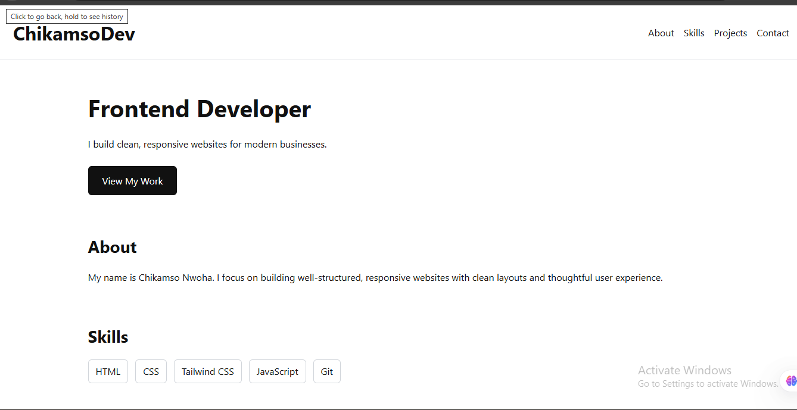

# Personal Portfolio

Version 1 of my personal portfolio built using **HTML and CSS only**.

This project was created to demonstrate my foundational frontend skills,
code structure, and ability to build clean, responsive layouts without frameworks.

## ✨ Features

- Fully responsive layout (desktop → mobile)
- Semantic HTML for accessibility and structure
- Clean, readable CSS using Flexbox and Grid
- Simple, professional UI focused on clarity

## 🚀 Demo

Live site:  
https://chikamsodev.github.io/Personal-Portfolio/

## 🛠 Tech Stack

- HTML5
- CSS3

## 🎯 What This Project Demonstrates

- Strong understanding of layout fundamentals
- Ability to structure content semantically
- Responsive design without JavaScript or frameworks
- Clean, maintainable CSS

## 🔮 Planned Improvements

- Add JavaScript for mobile navigation (v3)
- Rebuild using Tailwind CSS to demonstrate utility-first workflow (v2)

## 👤 Author

**Chikamso Nwoha**  
Aspiring Frontend Developer
